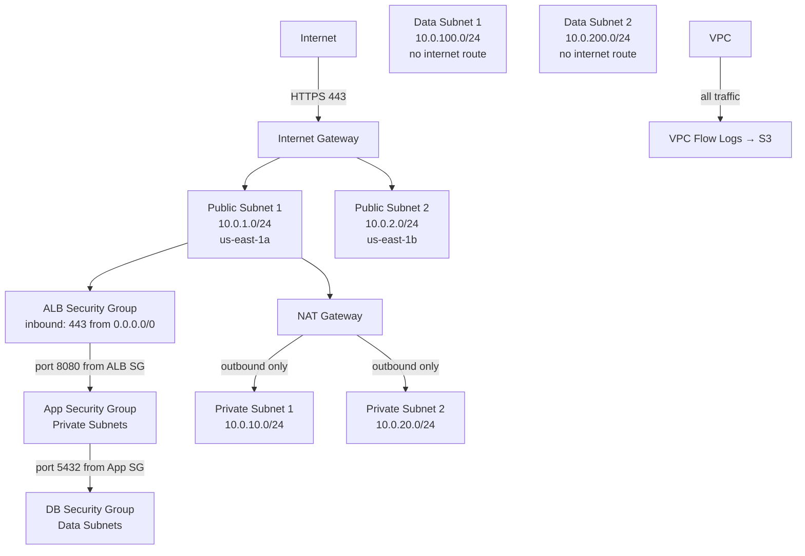
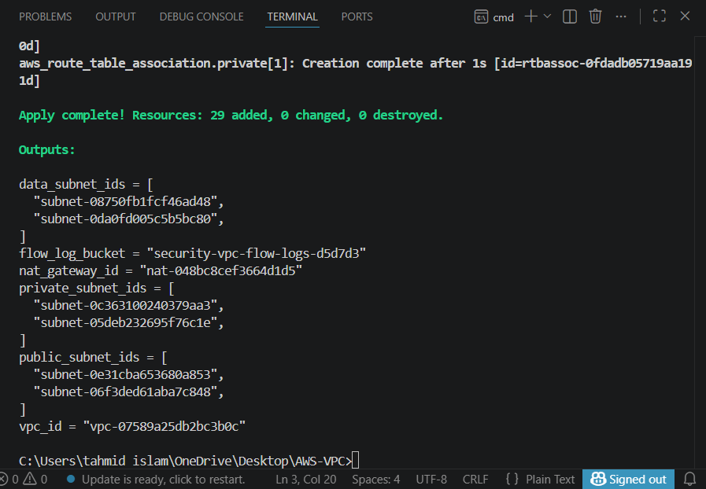
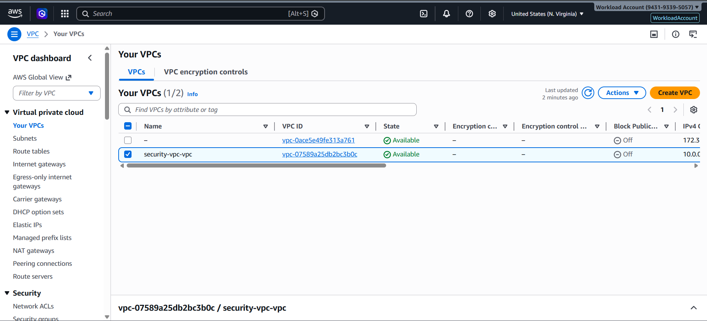
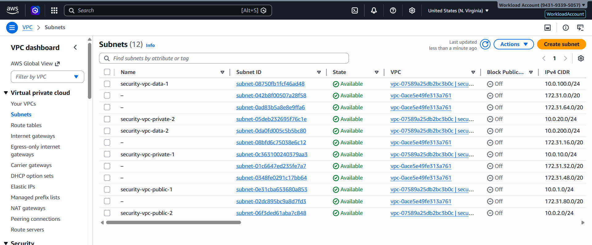
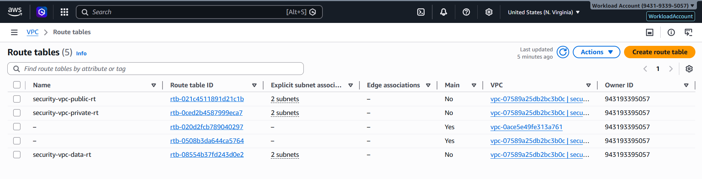
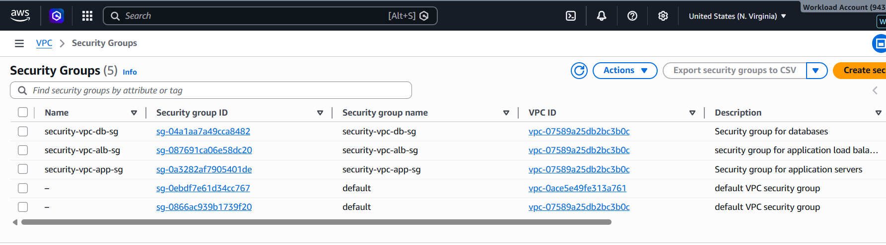
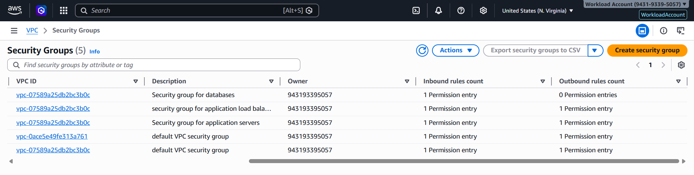
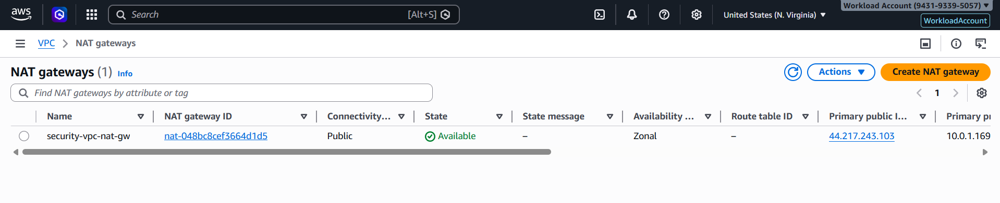

# AWS VPC with Terraform

Production-grade three-tier VPC deployed via Terraform to AWS. Public, private, and data subnets across two availability zones, with least-privilege chained security groups, NACLs, NAT gateway, and VPC flow logs to S3.

29 resources deployed. All destroyed after screenshots were taken.

---

## Architecture



---

## Overview

I built a three-tier VPC that mirrors how production AWS environments are typically structured for a web application: a public tier for load balancers, a private tier for application servers, and a data tier for databases. Each tier has its own subnets, route tables, and security boundaries.

The focus was on getting the security controls right: chained security groups that don't use hardcoded CIDRs, NACLs as a stateless second layer, and flow logs capturing all traffic to S3 for forensics.

---

## AWS account

| Detail | Value |
|---|---|
| Account | WorkloadAccount (943193395057) |
| Region | us-east-1 |
| Deployed via | `terraform-deployer` IAM user (AdministratorAccess) |
| CLI profile | `workload` |
| Total resources | 29 |

---

## Terraform files

```
terraform/
├── main.tf            # Provider config (workload account, us-east-1)
├── variables.tf       # VPC CIDR, subnet CIDRs, AZs, project name
├── terraform.tfvars   # Variable values
├── vpc.tf             # VPC resource with DNS support enabled
├── subnets.tf         # 6 subnets (2 public, 2 private, 2 data)
├── routing.tf         # Route tables and associations
├── nat.tf             # Internet gateway, EIP, NAT gateway
├── security_groups.tf # ALB, App, and DB security groups
├── nacls.tf           # Public subnet NACL rules
├── flow_logs.tf       # VPC flow log → S3 bucket
└── outputs.tf         # VPC ID, subnet IDs, SG IDs
```

---

## Network design

### Subnets

| Subnet | CIDR | AZ | Route |
|---|---|---|---|
| Public 1 | 10.0.1.0/24 | us-east-1a | IGW |
| Public 2 | 10.0.2.0/24 | us-east-1b | IGW |
| Private 1 | 10.0.10.0/24 | us-east-1a | NAT Gateway |
| Private 2 | 10.0.20.0/24 | us-east-1b | NAT Gateway |
| Data 1 | 10.0.100.0/24 | us-east-1a | None |
| Data 2 | 10.0.200.0/24 | us-east-1b | None |

### Route tables

Three route tables, one per tier:
- Public: `0.0.0.0/0 → Internet Gateway`
- Private: `0.0.0.0/0 → NAT Gateway` (outbound only, no inbound from internet)
- Data: no default route (fully isolated from internet, inbound and outbound)

---

## Security groups

The three security groups are chained: each one references the previous group as its source rather than using IP CIDRs. This is the correct pattern for multi-tier applications.

```hcl
# ALB SG: accepts HTTPS from internet
ingress {
  from_port   = 443
  to_port     = 443
  protocol    = "tcp"
  cidr_blocks = ["0.0.0.0/0"]
}

# App SG: only accepts traffic from ALB SG
ingress {
  from_port       = 8080
  to_port         = 8080
  protocol        = "tcp"
  security_groups = [aws_security_group.alb.id]
}

# DB SG: only accepts traffic from App SG
ingress {
  from_port       = 5432
  to_port         = 5432
  protocol        = "tcp"
  security_groups = [aws_security_group.app.id]
}
```

The DB has no egress rule defined. By default, AWS blocks all inbound traffic not explicitly allowed. The DB SG only opens port 5432 to the App SG, nothing else.

---

## NACLs

NACLs are stateless, which means you have to explicitly allow both inbound and outbound traffic, including return traffic on ephemeral ports.

Public subnet NACL rules:

```hcl
# Inbound: HTTPS from internet
rule 100 - allow TCP 443 from 0.0.0.0/0

# Inbound: ephemeral ports for return traffic
rule 200 - allow TCP 1024-65535 from 0.0.0.0/0

# Outbound: all traffic
rule 100 - allow all to 0.0.0.0/0
```

The ephemeral port range (1024-65535) is required because TCP responses use dynamically assigned ports. Without this rule, the NACL blocks the return packets and connections fail, something that's easy to miss and hard to debug.

---

## VPC flow logs

```hcl
resource "aws_flow_log" "main" {
  vpc_id               = aws_vpc.main.id
  traffic_type         = "ALL"
  log_destination_type = "s3"
  log_destination      = aws_s3_bucket.flow_logs.arn
}
```

Flow logs capture all traffic (ACCEPT and REJECT) for the entire VPC and ship them to an S3 bucket with a random suffix to avoid naming conflicts. This is the first place you look when debugging network connectivity issues or investigating suspicious traffic patterns.

---

## Screenshots

### 1. terraform apply — 29 resources created


`terraform apply` output showing all 29 resources created successfully. This includes the VPC, 6 subnets, 3 route tables, 6 route table associations, internet gateway, EIP, NAT gateway, 3 security groups, NACL with 3 rules, flow log, and S3 bucket.

---

### 2. VPC in console


The VPC in the AWS console with the correct CIDR (10.0.0.0/16), DNS resolution and DNS hostnames both enabled. DNS support is required if you want EC2 instances to resolve each other by hostname rather than just IP.

---

### 3. All 6 subnets


All 6 subnets across two AZs. The naming convention (`-public-`, `-private-`, `-data-`) makes the tier visible without opening each subnet. CIDRs are non-overlapping and organized to make future expansion straightforward.

---

### 4. Route tables — three tiers


Three route tables, one per tier. Public routes through the IGW, private routes through the NAT gateway, data has no default route. The absence of a route is the control; you can't add a route to nowhere, you just don't add one.

---

### 5. Security groups


All three security groups: ALB, App, and DB. Each one named with the project prefix so they're identifiable in the console without cross-referencing IDs.

---

### 6. Security group rules — chained references


The App SG inbound rules showing the source as the ALB SG ID (not a CIDR). Same pattern on the DB SG pointing to the App SG ID. This is the chaining pattern: if you replace the ALB SG, you update one reference and all downstream rules stay correct.

---

### 7. NAT gateway


NAT gateway deployed in the first public subnet with an Elastic IP. Private subnets route outbound traffic through this; they can initiate connections to the internet (software updates, API calls) but cannot receive inbound connections. The data subnets don't route through NAT at all.

---

## Security decisions

**Why chain security groups instead of using CIDRs?**
If you hardcode a CIDR like `10.0.10.0/24` as the source in the DB SG, anything with an IP in that range can reach the database, not just the app servers. Referencing the App SG by ID means only instances actually attached to the App SG can connect, regardless of IP. It also means you don't have to update the rule if you re-subnet.

**Why does the data tier have no internet route at all?**
The database tier should never initiate or receive internet connections. Removing the route entirely is stronger than blocking it with a security group rule. A misconfigured SG can be changed accidentally, but a missing route table entry is harder to overlook. Defense in depth: no route + SG restriction.

**Why NACLs in addition to security groups?**
Security groups are stateful: they track connections and automatically allow return traffic. NACLs are stateless: every packet is evaluated independently. Having both means a misconfigured security group doesn't automatically bypass the network layer. They're independent controls operating at different layers (instance vs. subnet).

**Why log ALL traffic instead of just REJECT?**
ACCEPT logs show what's actually communicating inside the VPC. REJECT logs alone tell you what's being blocked, but you can't reconstruct a full traffic picture. For incident investigation, you need both: what went through and what was stopped.

---

## Skills demonstrated

- VPC architecture (three-tier, multi-AZ)
- Subnet design and CIDR allocation
- Route table configuration (IGW, NAT, no-route isolation)
- Security group chaining (least-privilege, no hardcoded CIDRs)
- Network ACLs (stateless rules, ephemeral port handling)
- NAT gateway for private subnet outbound access
- VPC flow logs to S3
- Terraform IaC (10 files, 29 resources, multi-file organization)
- AWS multi-account deployment with named CLI profiles
